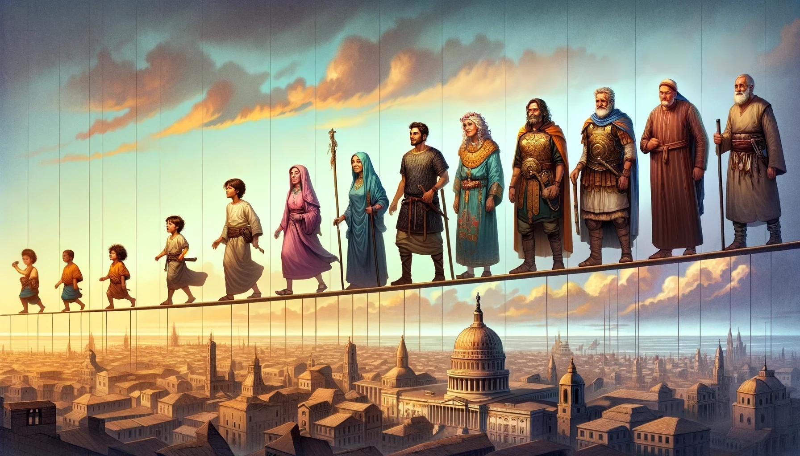

# Grand Chronicle

## Description

Grand Chronicle allows users to create fictional characters who experience real historical events, providing insights into what else these characters might have encountered in their lifetimes.

## Roadmap

- [x] **Groundwork**
  - [x] Create README
  - [x] Add license
  - [x] Create folder structure
  - [x] Create .gitignore
- [ ] **Setup**
  - [ ] Create React frontend
  - [ ] Create Node.js/Express backend
  - [ ] Create MongoDB database
- [ ] **API Integration**
  - [ ] Use Wikipedia API to fetch historical event data.
- [ ] **Character Creation**
  - [ ] Develop UI for users to create and customize characters.
- [ ] **Data Matching**
  - [ ] Implement logic to match characters with relevant historical events.
- [ ] **User Profiles**
  - [ ] Add user authentication and profiles to save character histories.
- [ ] **Enhancements**
  - [ ] Add more detailed event timelines
  - [ ] Add more interactions.

## Tech Stack

<!--  -->

- **Frontend**: React, CSS
- **Backend**: Node.js, Express
- **Database**: MongoDB
- **API**: Wikipedia API
